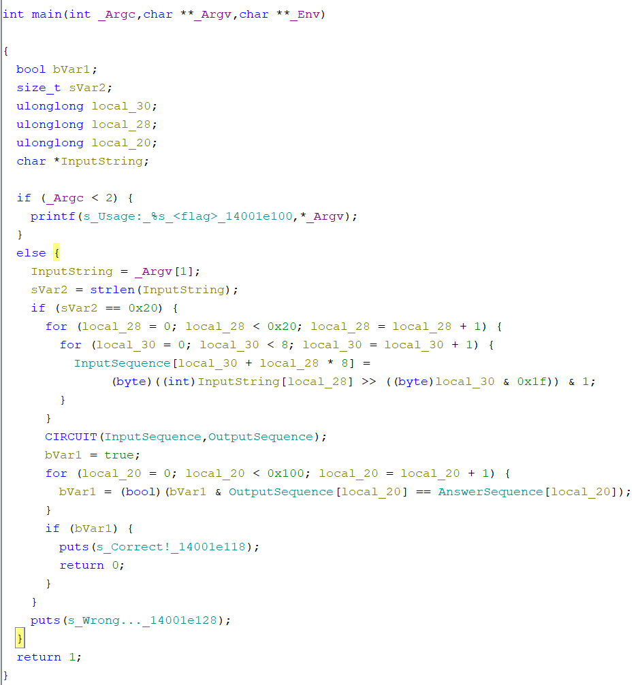
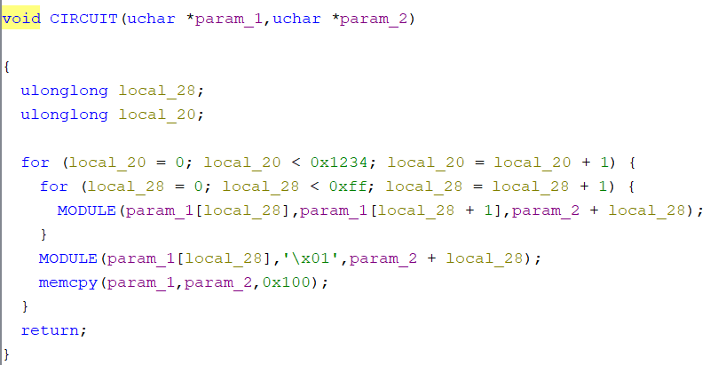
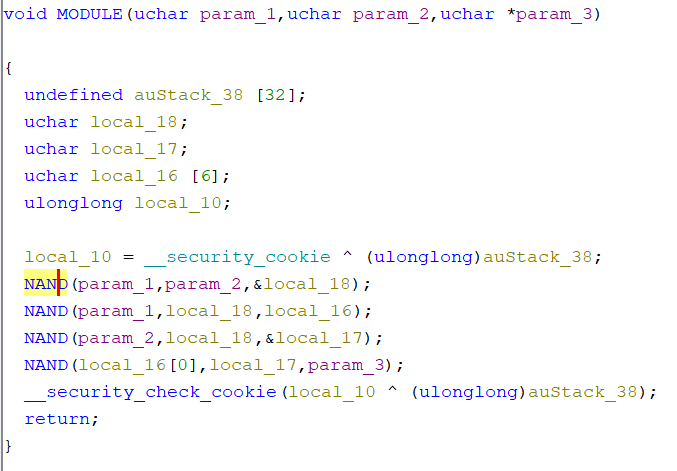
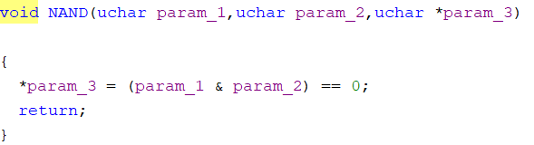

Reverse Engineering - 104 points

nande

What makes NAND gates popular?

Solve:

First, we load the program to ghidra and find the disassembly of the main function.


In the first few line, we can see that if we did not provide a runtime argument the program terminates or the argument has a length other than 32, the program will termiante.

After the length matches, it them loops through each bit of each character and turns the input into an array of 1 and 0 based on the ASCII code of the input. The result is stored in a variable named "InputSequence". This is also shown by looking at the size of InputSequence as it holds 256 char because 32 * 8 = 256.

Then it calls CIRCUIT function on two variables "InputSequence" and "OutputSequence". Next OutputSequence is compared to another variable named "AnswerSequence" and it only returns correct if all characters if both variables matches. 

Going into the CIRCUIT funciton we see the following code:



It looks like the we are looping through each index of "InputSequence" variable except the last index and pass the current element, the next element and the current element from "OutputSequence" into MODULE function. As for the last index next to it we pass the last element from "InputSequence" variable, value 1 and the last element from "OutputSequence" into MODULE. The loop is then execute (0x1234 = 4660) times in total.

Going into the MODULE function we see the following:



Another function NAND is introduced and here is what that looks like:



We can see, the NAND function will do the logic NAND operation on the first and second input and store the result into the address of the third input.

With that in mind we can write the logic of MODULE function using bitwise operation: ((Input1 NAND (Input1 NAND Input2)) NAND (Input2 NAND (Input1 NAND Input2))). In the end, the result is stored in Input3, which is part of the 'OutputSequence' variable.

We want to simplify this bitwise operation so we drawout the truth table for ((Input1 NAND (Input1 NAND Input2)) NAND (Input2 NAND (Input1 NAND Input2))) and here is what we found:

Input1  |  Input2  |  Result <br />
   F    |    F     |    F <br />
   T    |    F     |    T <br />
   F    |    T     |    T <br />
   T    |    T     |    F <br />

Based on the result, we can conclude that ((Input1 NAND (Input1 NAND Input2)) NAND (Input2 NAND (Input1 NAND Input2))) will produce the result of Input1 XOR Input2 and therefore the logic of MODULE function can be represented as storing the value of Input1 XOR Input2 into Input3.

Based on the nested for loop we have above and the logic of MODULE function we know that the program is XORing each index with its next index repeatly. We can use a python script to simulate this nested loop and find out which index is XOR'ed with which in the end. Another property of XOR is that A XOR B XOR B = A, which means if an index is XOR'ed with another index twice, then we can assume nothing happened.

We start by generating a "blueprint" in python on which index is XOR'ed with which based on the nested loop. We can archieve this by:\
```
from collections import Counter

def remove_even_occurrences(arr):
    counts = Counter(arr)
    result = [element for element in arr if counts[element] % 2 != 0]
    return result

for x in range(1,256+1):
    list.append([x])

for a in range(4660):
    for b in range(len(list) - 1):
        list[b] = remove_even_occurrences(list[b] +list[b+1]).copy()
    list[len(list) - 1] = remove_even_occurrences(list[len(list) - 1] + [0]).copy()
```
Now inside list, we have a list of number in each index start at index 1. Each list represents which index is XOR'ed with the current index. Index 0 has the 1 constant.

We know that OutputSequence is the out of CIRCUIT and it compared against AnswerSequence. This means if we XOR each index with the corresponding number in the blue print for that index (except itself), then we get back the original bit. We need to start from the last index because based on the blue print, each index is ONLY XOR'ed with the value before it.

```
answer = [1,1, 1, 1, 1, 1, 0, 0, 1, 1, 0, 0, 1, 0, 0, 1, 0, 0, 1, 1, 0, 0, 0, 0, 1, 1, 1, 1, 1, 0, 0, 1, 1, 1, 1, 0, 1, 0, 1, 1, 1, 0, 0, 0, 1, 1, 0, 1, 1, 1, 1, 0, 1, 0, 1, 0, 0, 1, 0, 1, 0, 1, 1, 0, 1, 0, 0, 1, 1, 0, 1, 1, 0, 0, 0, 0, 0, 1, 0, 0, 0, 0, 1, 0, 0, 1, 0, 0, 1, 0, 1, 1, 1, 0, 0, 1, 1, 1, 0, 0, 1, 1, 1, 0, 1, 0, 1, 1, 1, 1, 0, 1, 1, 0, 0, 0, 1, 1, 0, 0, 1, 1, 0, 1, 1, 0, 0, 0, 1, 0, 1, 1, 1, 0, 1, 0, 0, 0, 0, 1, 0, 0, 0, 0, 1, 1, 1, 0, 1, 0, 0, 0, 1, 1, 0, 0, 1, 0, 0, 0, 0, 0, 1, 0, 0, 0, 0, 1, 1, 1, 1, 1, 1, 1, 1, 1, 0, 1, 0, 1, 0, 0, 1, 1, 0, 1, 1, 1, 0, 1, 0, 1, 0, 1, 0, 0, 0, 0, 0, 0, 1, 1, 0, 1, 1, 0, 1, 1, 0, 1, 0, 1, 0, 1, 0, 0, 1, 1, 1, 1, 1, 0, 1, 1, 0, 1, 1, 1, 0, 0, 1, 0, 1, 1, 0, 1, 1, 0, 0, 1, 0, 0, 1, 1, 0, 0, 1, 1, 1, 0, 1, 0, 1, 0, 1, 1, 0]
for y in range(256,0,-1):
    format = template[y - 1]
    answer[y] = xor_list(map(lambda x: answer[x], format))
```

We then remove the first index of answer because it is a constand we added. Then we split the array into 8 length each and we convert the 8 length array into a binary number then into an ASCII character.

```
def split_and_convert(arr):
    chunked_list = [arr[i:i + 8] for i in range(0, len(arr), 8)]

    decimal_list = []
    ascii_list = []
    for chunk in chunked_list:
        binary_string = ''.join(str(bit) for bit in chunk)
        decimal = binary_to_decimal(binary_string)
        decimal_list.append(decimal)
        ascii_char = chr(decimal)
        ascii_list.append(ascii_char)

answer.pop(0)
answer= answer[::-1]
print(answer)
print(''.join(split_and_convert(answer)[1][::-1]))
```

```
Then we get the flag: CakeCTF{h2fsCHAo3xOsBZefcWudTa4}
```


